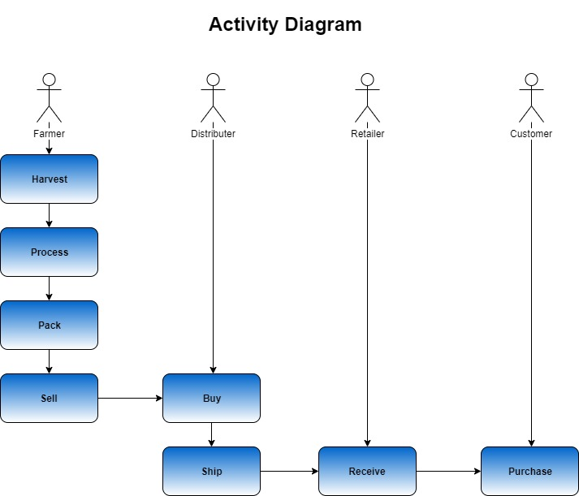
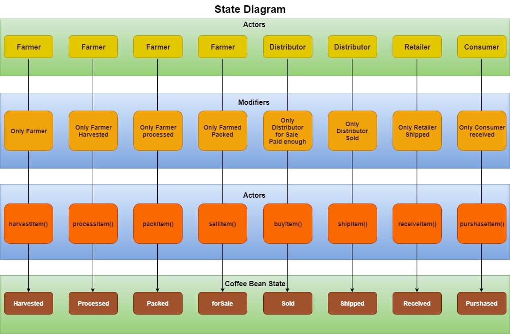
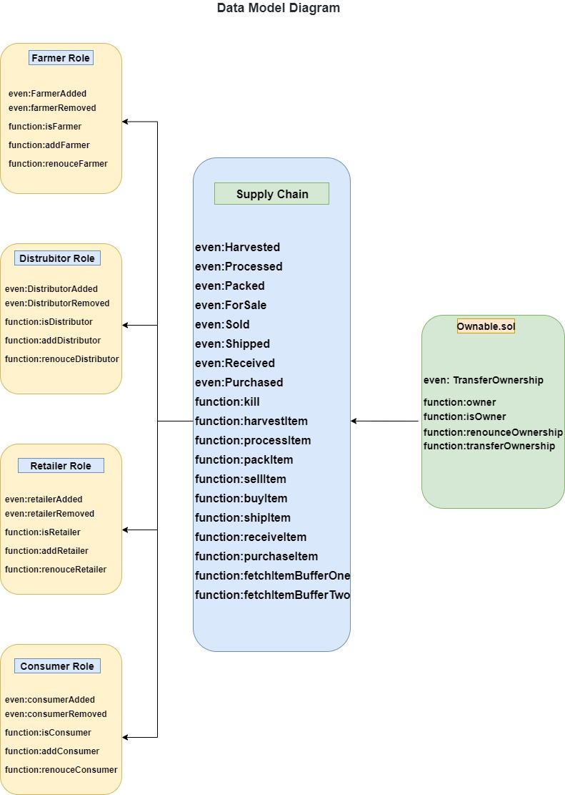

# Supply chain & data auditing

This repository containts an Ethereum DApp that demonstrates a Supply Chain flow between a Seller and Buyer. The user story is similar to any commonly used supply chain process. A Seller can add items to the inventory system stored in the blockchain. A Buyer can purchase such items from the inventory system. Additionally a Seller can mark an item as Shipped, and similarly a Buyer can mark an item as Received.

## Project write-up - UML

### Activity


### Sequence


### State


### Classes (Data Model)


## IPFS
IPFS is not used in this project

## Program Versions numbers
Node: v14.21.1
Solidity: v0.4.24
Truffle: v5.0.25

## Contract address on the Rinkeby test network (Etherscan):
https://rinkeby.etherscan.io/address/0x963865f57804b38459dd4b2da2f760211a200438

## Transaction ID and contract address

Starting migrations...
======================
> Network name:    'develop'
> Network id:      5777
> Block gas limit: 6721975 (0x6691b7)


1_initial_migration.js
======================

   Deploying 'Migrations'
   ----------------------
   > transaction hash:    0xf27900518799d0e7e97391e5439a40022bccaa8692d89ba8f563f9e68b5e95d0
   > Blocks: 0            Seconds: 0
   > contract address:    0xcF6670d502967845Af531126bB4196f65a01A20D
   > block number:        1
   > block timestamp:     1674482118
   > account:             0x07001B00EEB4B29D56d20d17e63EfFc1ecD2a696
   > balance:             99.99919035775
   > gas used:            239894 (0x3a916)
   > gas price:           3.375 gwei
   > value sent:          0 ETH
   > total cost:          0.00080964225 ETH

   > Saving migration to chain.
   > Saving artifacts
   -------------------------------------
   > Total cost:       0.00080964225 ETH


2_deploy_contracts.js
=====================

   Deploying 'FarmerRole'
   ----------------------
   > transaction hash:    0xbd9af9764c48ccc36a6017f2fe77e172b2dbedfadb8b9cae950c1e56126d5a1d
   > Blocks: 0            Seconds: 0
   > contract address:    0x0e005597E80bB50CADC837858319de7889FB91Fe
   > block number:        3
   > block timestamp:     1674482118
   > account:             0x07001B00EEB4B29D56d20d17e63EfFc1ecD2a696
   > balance:             99.997605325393234924
   > gas used:            451620 (0x6e424)
   > gas price:           3.178068732 gwei
   > value sent:          0 ETH
   > total cost:          0.00143527940074584 ETH


   Deploying 'DistributorRole'
   ---------------------------
   > transaction hash:    0xf3e65fe674255804aa98c16ea180da2bee0a867e1ef44fd91c0b4d6ea07f4283
   > Blocks: 0            Seconds: 0
   > contract address:    0xd7102150277Dbf1cf4421E7C84Bb6271C7ABa8f7
   > block number:        4
   > block timestamp:     1674482118
   > account:             0x07001B00EEB4B29D56d20d17e63EfFc1ecD2a696
   > balance:             99.996202957575990388
   > gas used:            451692 (0x6e46c)
   > gas price:           3.104699258 gwei
   > value sent:          0 ETH
   > total cost:          0.001402367817244536 ETH


   Deploying 'RetailerRole'
   ------------------------
   > transaction hash:    0x86f0da523a2a0f2011441d916ce2d867d4d4cef0498e4f35c14719d760c49570
   > Blocks: 0            Seconds: 0
   > contract address:    0x9e64A6Dd84875A16C1Bc699aA5Ae86DA1D60f2Fa
   > block number:        5
   > block timestamp:     1674482118
   > account:             0x07001B00EEB4B29D56d20d17e63EfFc1ecD2a696
   > balance:             99.994830216463423396
   > gas used:            451668 (0x6e454)
   > gas price:           3.039270244 gwei
   > value sent:          0 ETH
   > total cost:          0.001372741112566992 ETH


   Deploying 'ConsumerRole'
   ------------------------
   > transaction hash:    0x4faba393aa30271fffb40d54b32162a8168d1655b7f13974e2bc87deb32b5478
   > Blocks: 0            Seconds: 0
   > contract address:    0xeF9c92a4C4508a309454537112CC493d3290116A
   > block number:        6
   > block timestamp:     1674482118
   > account:             0x07001B00EEB4B29D56d20d17e63EfFc1ecD2a696
   > balance:             99.993483865956925828
   > gas used:            451656 (0x6e448)
   > gas price:           2.980920228 gwei
   > value sent:          0 ETH
   > total cost:          0.001346350506497568 ETH


   Deploying 'SupplyChain'
   -----------------------
   > transaction hash:    0xb910126dd2f1c4b75f9e1f444d68931ab5d953d99c04500af27e6f1100bc1f0a
   > Blocks: 0            Seconds: 0
   > contract address:    0x6A336A654A7CeE19dFEe554C8EB7b640f75a93ef
   > block number:        7
   > block timestamp:     1674482118
   > account:             0x07001B00EEB4B29D56d20d17e63EfFc1ecD2a696
   > balance:             99.985027672379042353
   > gas used:            2887173 (0x2c0e05)
   > gas price:           2.928883575 gwei
   > value sent:          0 ETH
   > total cost:          0.008456193577883475 ETH

   > Saving migration to chain.
   > Saving artifacts
   -------------------------------------
   > Total cost:     0.014012932414938411 ETH

Summary
=======
> Total deployments:   6
> Final cost:          0.014822574664938411 ETH

The DApp User Interface when running should look like...


## Getting Started

These instructions will get you a copy of the project up and running on your local machine for development and testing purposes. See deployment for notes on how to deploy the project on a live system.

### Prerequisites

Please make sure you've already installed ganache-cli, Truffle and enabled MetaMask extension in your browser.

```
Give examples (to be clarified)
```

### Installing

> The starter code is written for **Solidity v0.4.24**. At the time of writing, the current Truffle v5 comes with Solidity v0.5 that requires function *mutability* and *visibility* to be specified (please refer to Solidity [documentation](https://docs.soliditylang.org/en/v0.5.0/050-breaking-changes.html) for more details). To use this starter code, please run `npm i -g truffle@4.1.14` to install Truffle v4 with Solidity v0.4.24. 

A step by step series of examples that tell you have to get a development env running

Clone this repository:

```
git clone https://github.com/udacity/nd1309/tree/master/course-5/project-6
```

Change directory to ```project-6``` folder and install all requisite npm packages (as listed in ```package.json```):

```
cd project-6
npm install
```

Launch Ganache:

```
ganache-cli -m "spirit supply whale amount human item harsh scare congress discover talent hamster"
```

Your terminal should look something like this:


In a separate terminal window, Compile smart contracts:

```
truffle compile
```

Your terminal should look something like this:


This will create the smart contract artifacts in folder ```build\contracts```.

Migrate smart contracts to the locally running blockchain, ganache-cli:

```
truffle migrate
```

Your terminal should look something like this:


Test smart contracts:

```
truffle test
```

All 10 tests should pass.


In a separate terminal window, launch the DApp:

```
npm run dev
```

## Built With

* [Ethereum](https://www.ethereum.org/) - Ethereum is a decentralized platform that runs smart contracts
* [IPFS](https://ipfs.io/) - IPFS is the Distributed Web | A peer-to-peer hypermedia protocol
to make the web faster, safer, and more open.
* [Truffle Framework](http://truffleframework.com/) - Truffle is the most popular development framework for Ethereum with a mission to make your life a whole lot easier.


## Authors

See also the list of [contributors](https://github.com/your/project/contributors.md) who participated in this project.

## Acknowledgments

* Solidity
* Ganache-cli
* Truffle
* IPFS
